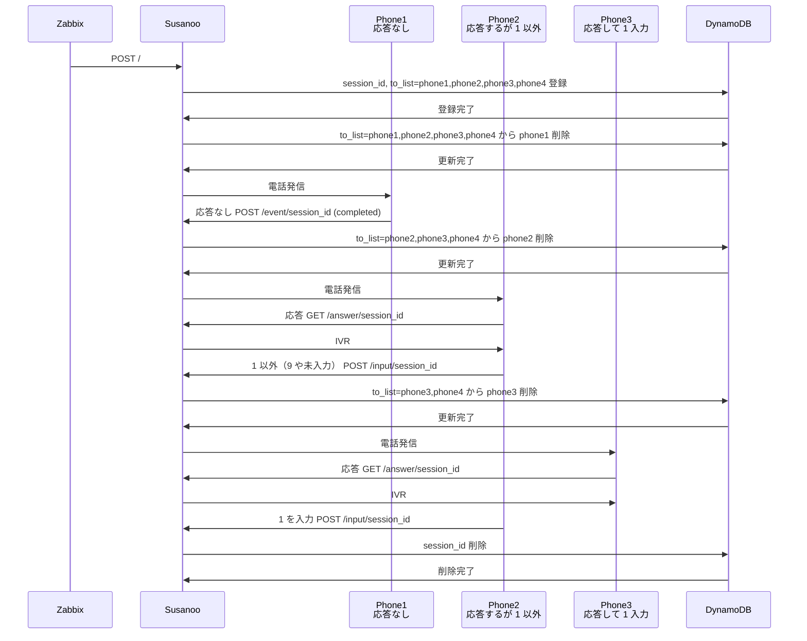

# Susanoo

## Susanoo とは

- Susanoo は curl や Zabbix、Mackerel から POST を受けると電話通知（オンコール）
  - ランダムな輪番架電（ラウンドロビン）に対応
  - 留守番電話の場合は次の電話番号に自動架電
- Susanoo は FastAPI による Web サーバ。Lambda でも動作

## 使い方

1. Susanoo は発信先の電話番号や、電話で流すメッセージを受け取ると、指定電話番号に架電
1. 受話しない（呼び出しに応じない、着信拒否、通話中含む）と次の人に自動架電
1. 受話したら 1 を押すとメッセージが流れて終了
    - 1 以外を押す、5 秒以上押さない（留守番電話）と次の人に自動架電

| パラメータ | デフォルト | 説明 |
| --- | --- | --- |
| to | | 必須。発信先電話番号。カンマ区切りで複数指定可能<br>Ex. to=060-0000-0000,817000000000 |
| body | | 必須。通知内容。誤読する場合はカタカナ表記 |
| loop | 3 | 繰り返し架電回数。最大 10 |
| round_robin | 1 | 1 の場合は to をシャッフルして架電。0 は指定した順番で架電 |

### curl での利用

```shell
# curl 7.82.0+
curl -X POST https://your-lambda-url.on.aws \
  --json '{"to": "090-0000-0000,08000000000", "body": "Zabbix を確認してください"}'

# curl < 7.82.0
curl -X POST https://your-lambda-url.on.aws \
  -H "Content-Type: application/json" \
  -d '{"to": "03-0000-0000", "body": "ファイル foo.js でエラー xxx が発生"}'

# URL パラメータ指定可能
BODY=$(node -p 'encodeURIComponent("curl は urlencode しないと 日本語が使えません")')
curl -X POST "https://your-lambda-url.on.aws/?to=815000000000,050-0000-0000&body=$BODY&loop=10&round_robin=0"
```

### httpie での利用

```shell
http POST your-lambda-url.on.aws \
  to="815000000000,050-0000-0000" \
  body="Mackerel を確認してください" \
  loop=2 \
  round_robin=0

# URL パラメータ指定可能
http POST "https://your-lambda-url.on.aws/?to=815000000000,050-0000-0000&loop=2&round_robin=0&body=Webサーバ 1 2 3 で障害が発生しました"
```

### Mackerel 設定例

1. 左メニューの「チャネル」
1. 画面右上の「通知グループ/通知チャンネルを追加」
1. 「Webhook」を選択
1. 「URL」に Susanoo の URL パラメータを指定（curl や httpie 参照）
1. 「作成」を選択

### Zabbix 7.2 設定例

1. 左メニューの「Alerts」
1. 「Media TYpes」を選択
1. 画面右上の「Create media type」を選択
1. 「Name」に「Susanoo」と入力
1. 「Type」を「Webhook」に変更
1. 「Parameters」はすべて削除
1. 「Script」に下記を設定
1. 画面右下の「Add」を選択

```js
// https://www.zabbix.com/documentation/current/en/manual/config/notifications/media/webhook/webhook_examples
try {
    const params = JSON.parse(value);
    const url = "https://your.lambda-url.ap-northeast-1.on.aws";
    const payload = JSON.stringify({
        to: "03-0000-0000,06-0000-00000",
        body: "Zabbix を確認してください"
    });

    const request = new HttpRequest();
    request.addHeader('Content-Type: application/json');
    const response = request.post(url, payload);

    if (typeof response === 'object' && response.getResponseCode) {
        Zabbix.log(4, '[Susanoo] Response code: ' + response.getResponseCode());
        Zabbix.log(4, '[Susanoo] Response body: ' + response.getResponseBody());
    } else {
        Zabbix.log(4, '[Susanoo] Failed to send request or received unexpected response: ' + response);
    }

    return response;
}
catch (error) {
    Zabbix.log(4, '[Susanoo] Issue creation failed json : ' + JSON.stringify({ "fields": fields }));
    Zabbix.log(3, '[Susanoo] issue creation failed : ' + error);
    throw 'Failed with error: ' + error;
}
```

## コスト

電話の機能は Vonage を利用。

| | |
| --- | ---: |
| 電話番号 | 165円/月 |
| 固定電話発信 | 5.5円/分 |
| 携帯電話発信 | 18.0円/分 |
| 音声合成 | 0.11円/100文字 |

- 発信が発生しなかった月は 165 円のみ。初期費用やその他月額費用なし
- 発信料は秒課金。9 秒が 6 回で 54 秒。月末に分に切り上げて 54 → 60 秒
- 音声合成は通話単位。そのため 30 文字でも 100 文字に切り上げ
- 別途 Lambda と DynamoDB の料金。API Gateway は未使用

## インストール

### 必要要件

- 外部公開サーバ
  - 試用であれば ngrok
- Vonage の電話番号
  - [Vonage アカウントの作成](https://zenn.dev/kwcplus/articles/create-vonage-account)
  - [Vonage で電話番号の取得](https://zenn.dev/kwcplus/articles/buynumber-vonage)
- DynamoDB
- Python
  - uv
- direnv

### クイック・インストール

Vonage に慣れているのであれば下記手順で Susanoo は起動します。

```shell
git clone git@github:kwcplus/susanoo.git
cd susanoo
cp .env.example .env
$EDITOR .env
direnv allow
uv sync
uv run fastapi run
```

### 環境変数の設定

```.env``` を編集してください。

```shell
cp .env.example .env
direnv allow
```

#### SUSANOO_URL

外部公開サーバを指定。Vonage から電話の応答有無、入力した番号が送られます。

#### VONAGE_APPLICATION_ID と VONAGE_PRIVATE_KEY

Vonage ダッシュボードのアプリケーションから取得可能。取得手順は下記参照。

- [Vonage Voice API ガイド - アプリケーション](https://zenn.dev/kwcplus/articles/vonage-voice-guide#%E3%82%A2%E3%83%97%E3%83%AA%E3%82%B1%E3%83%BC%E3%82%B7%E3%83%A7%E3%83%B3)

```VONAGE_PRIVATE_KEY``` は Lambda の環境変数として登録しやすいように、秘密鍵を base64 にして一行にします。

```shell
base64 < private.key | tr -d '\n'
```

#### VONAGE_NUMBER

Vonage で取得した電話番号を設定。取得手順は下記を参照してください。

[Vonageで電話番号を取得する方法](https://zenn.dev/kwcplus/articles/buynumber-vonage)

電話番号は E.164/MSISDN 形式にします。電話番号の頭の 0 を[国番号](https://ja.wikipedia.org/wiki/%E5%9B%BD%E9%9A%9B%E9%9B%BB%E8%A9%B1%E7%95%AA%E5%8F%B7%E3%81%AE%E4%B8%80%E8%A6%A7)に置き換えます。

```text
050XXXXYYYY → 8150XXXXYYYY
```

#### AWS_ACCOUNT_ID

DynamoDB を利用する AWS のアカウント ID を指定

#### DYNAMODB_*

基本、変更する必要はありません。

```shell
DYNAMODB_TABLE_NAME=susanoo
DYNAMODB_REGION=ap-northeast-1
DYNAMODB_HOST=
```

### デプロイ

#### ngrok で試用

外部公開サーバを用意する前に ngrok で試用できます。Forwarding の URL を ```.env``` の ```SUSANOO_URL``` に設定。

```shell
ngrok http 8000
```

screen/zellij などで、もう一つシェルを開いて Susanoo を起動。

```shell
uv sync
uv run fastapi run
```

さらにもう一つのシェルを開いて Susanoo を実行。電話がかかってくれば成功です。

```shell
http POST localhost:8000 \
  to="070-0000-0000" \
  body="スサノオのテストです"
```

こちらでも実行可能です。

<http://localhost:8000/docs>

#### Lambda にデプロイ

SAM を利用してデプロイ。初回は ```SUSANOO_URL``` が分かりません。example.com を仮設定し、デプロイ後に発行される URL を ```SUSANOO_URL``` に設定し、再デプロイしてください。

```shell
# Lambda は requirements.txt が必要なため pyproject.toml から生成
$ uv pip compile -o app/requirements.txt pyproject.toml
# 環境変数を展開した template.yaml 用意
$ envsubst < sam-template.yaml > template.yaml
$ sam build
$ sam deploy --guided

        Setting default arguments for 'sam deploy'
        =========================================
        Stack Name [susanoo]:
        AWS Region [ap-northeast-1]:
        #Shows you resources changes to be deployed and require a 'Y' to initiate deploy
        Confirm changes before deploy [Y/n]:
        #SAM needs permission to be able to create roles to connect to the resources in your template
        Allow SAM CLI IAM role creation [Y/n]:
        #Preserves the state of previously provisioned resources when an operation fails
        Disable rollback [y/N]:
        SusanooFunction Function Url has no authentication. Is this okay? [y/N]: y
        Save arguments to configuration file [Y/n]: y
        SAM configuration file [samconfig.toml]:
        SAM configuration environment [default]:

# Lambda 関数 URL が発行されるため、.env の SUSANOO_URL を設定
$ $EDITOR .env
# SUSANOO_URL を設定後、再デプロイ
$ direnv allow
$ envsubst < sam-template.yaml > template.yaml
$ sam build
$ yes | sam deploy
```

下記で電話がかかってきたら成功です。

```shell
http POST $SUSANOO_URL \
  to="080-0000-0000" \
  body="Lambda のテストです"
```

Lambda 関数 URL を利用しているため、API Gateway のコストはかかりません。

## 開発者向け情報

### 処理の流れ

- session 発行し、以降の URL は session_id だけを引数にする
  - round_robin なら to をシャッフル
  - to_list は loop 回数で to をカンマ区切り
- 電話発信時に to_list の先頭を取り出して発信先にし、to_list から削除（輪番を実現）
  - to_list がなければ架電終了
  - 1 を押した場合は session 削除するため to_list が取得できず架電終了



## 開発環境の構築

ngrok と DynamoDB Local を利用し、FastAPI を開発者モードで起動。

### DynamoDB Local

[DynamoDB Local](https://docs.aws.amazon.com/ja_jp/amazondynamodb/latest/developerguide/DynamoDBLocal.html) を利用する場合は ```DYNAMODB_HOST``` を設定してください。FastAPI がポート 8000 を利用するため、DynamoDB Local は 8001 などを利用してください。

```shell
$ docker run -p 8001:8000 --name dynamodb-local amazon/dynamodb-local
$ grep DYNAMODB_HOST .env
DYNAMODB_HOST=http://localhost:8001
```

DynamoDB Local の中身を見るのに DynamoDB Admin が便利。

```shell
npm install -g dynamodb-admin
dynamodb-admin --dynamo-endpoint=http://localhost:8001 -p 8002 --skip-default-credentials
# http://localhost:8002/
```

### ngrok 起動

```SUSANOO_URL``` に Forwarding を設定

```shell
ngrok http 8000
```

### FastAPI を dev モードで起動

```shell
direnv allow
uv run fastapi dev
```

## テスト

```shell
uv run pytest
```

## lint & format

```shell
uv tool run ruff check --fix
uv tool run ruff format
```

## FAQ

- なぜ Susanoo?
  - 島根県で開催の JANOG56 出展用に開発したため。開発コード名でしたが、これよりいい名前はないとメンバーの総意により
- 海外の電話番号にも発信できますか？
  - はい。国番号をつけて to を指定してください Ex. to=886xxxxyyyy
- 留守番電話で料金が発生しますか
  - はい。電話の仕組み上、受話したのが留守番電話か人間か判定できないためです
